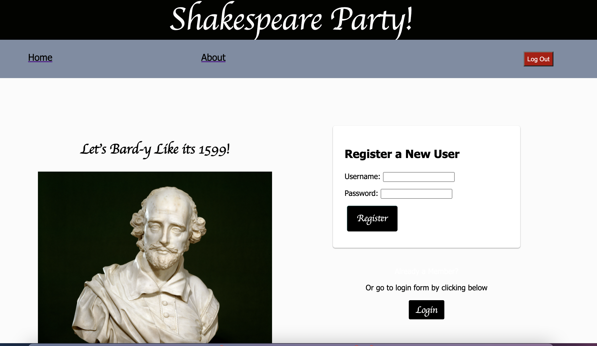
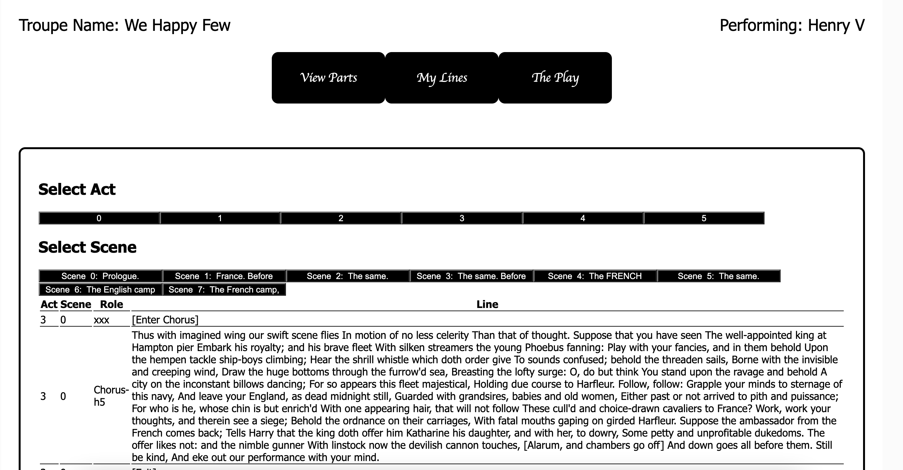

# Project Name

Shakespeare Party

## Description

_Duration: 2 weeks_

This application allows the user to select any play from the complete works of William Shakespeare and organize a performance with a group of friends. The application requires users register or log in if they are returning to the site. 

If registering, the application gives users a choice to start a new play or to join one a group member has already made. Those who originate the play have administrative access (director status) and can change the name of the acting troupe, remove performers from roles they have claimed, change who has director status in the troupe, and delete the troupe when the performance is complete. 

All players who login have access to the actor dashboard. From there, actors can claim parts, review their lines, and access the entire text of the play. 

## Screen shots

The home page

The play King Henry V rendered in the application

## Installation

### Required packages:
- gitHub repository files
- Node package manager (npm)
- postgreSQL

### Instructions

1. Fork and clone the repository from gitHub
2. Create a database named 'prime_app' in postgreSQL
3. Copy all of the text in the database.sql folder
4. Paste the text into a SQL query for your postgreSQL database
5. From terminal, navigate to the repo folder
6. Enter 'npm install' at the command line
7. At the command line, enter 'npm run server'
8. Open another terminal window, and navigate to the repo folder
9. At the command line, enter 'npm run client'

## Built With

- html
- css
- javascript
- React
- node.js
- PostgreSQL
- Redux
- SweetAlert

###Special thanks to George Mason University's [OpenSourceShakespeare](https://www.opensourceshakespeare.org/) Project for creating an open source mySQL database that was lightly modified for use in this application.

## License
[MIT](https://choosealicense.com/licenses/mit/)

## Acknowledgement
Thanks to [Prime Digital Academy](www.primeacademy.io) who equipped helped me make this application a reality. Sepcial thanks to my primary instructor, [Mary Mossman](https://github.com/mbMosman)

Special thanks to my friends and peers from my Vatti Cohort at Prime.

### For Iris 

## Support
If you have suggestions or issues, please email me at [steven.maloney@gmail.com](mailto:steven.maloney@gmail.com)
